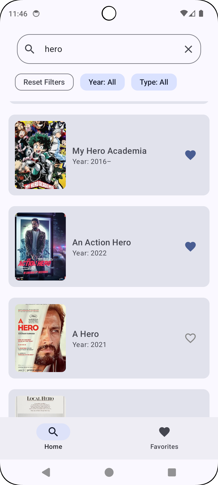
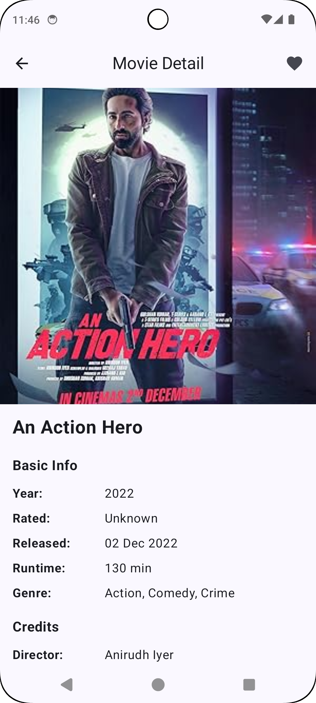
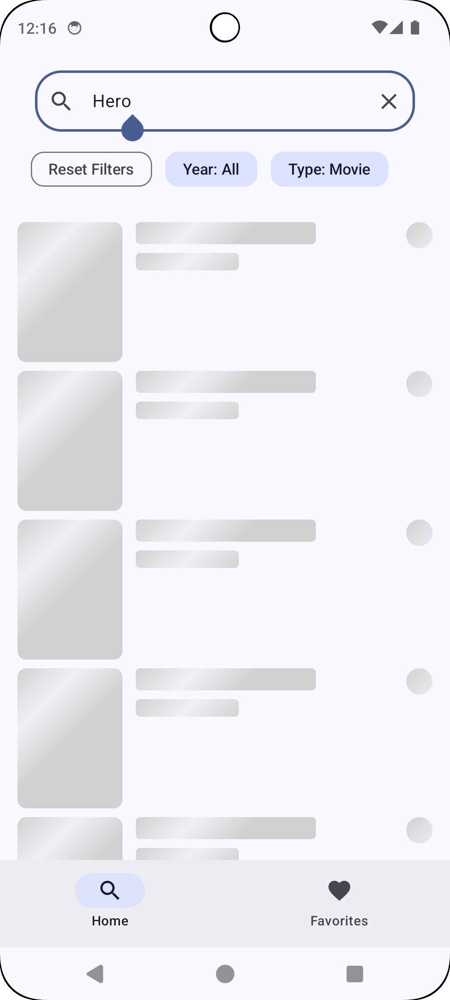
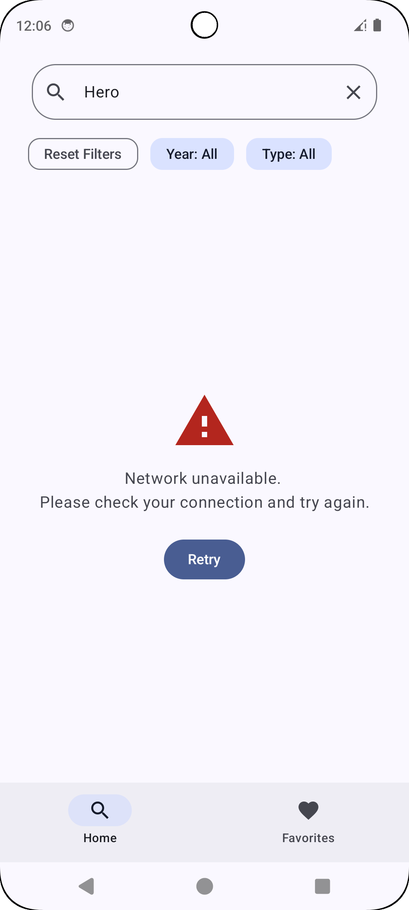
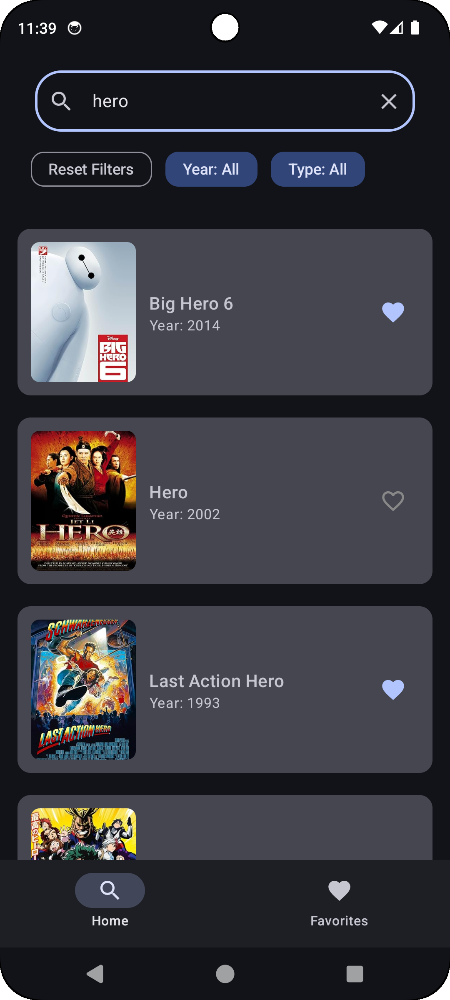
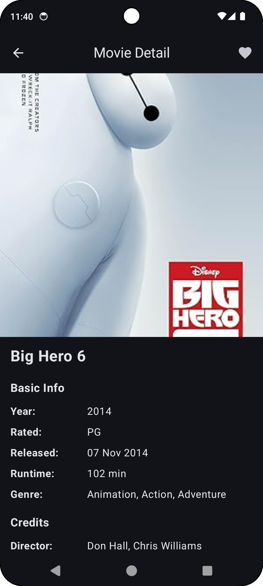
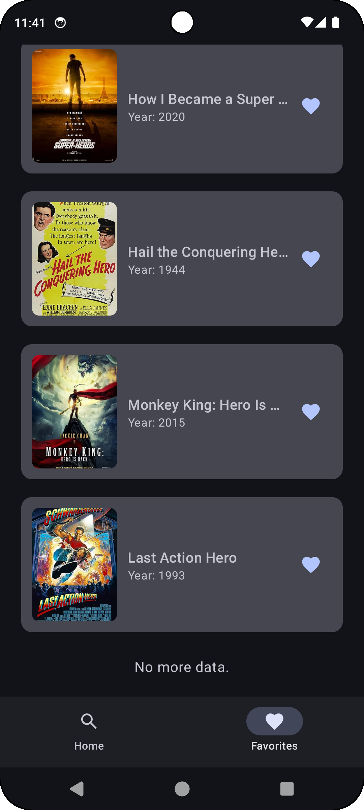
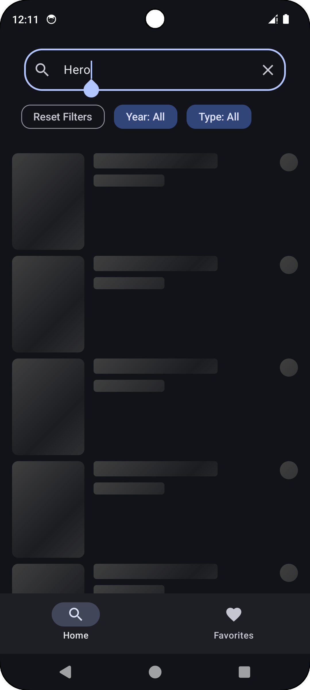
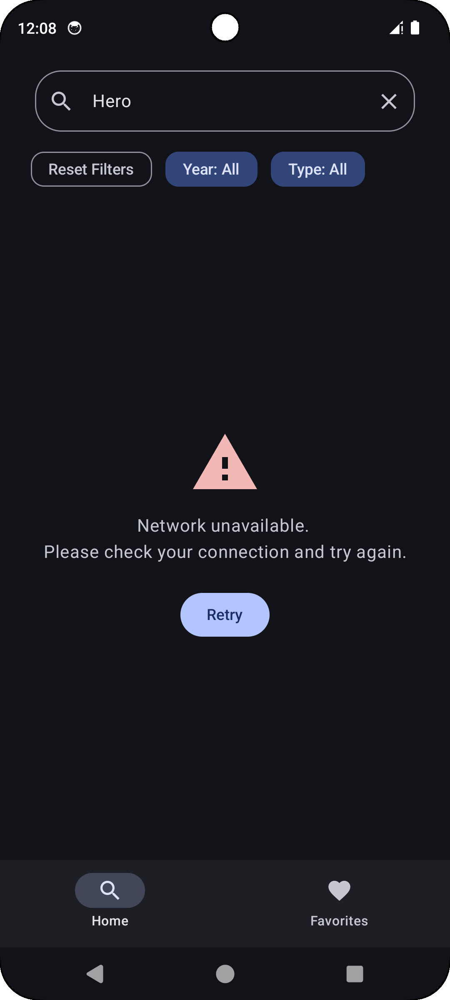

# CineQuest 🎬

**CineQuest** is a modern movie search and discovery Android app built with Jetpack Compose and Material 3, following Android's latest best practices.

---

## 📱 Screenshots(Light and Dark Mode full support)
| Home | Details | Favorites | Shimmer Skeleton | Error Handling |
|:----:|:-------:|:---------:|:--------------:|:--------------:|
|  |  |  |  | |
|  |  |  |  |  |
> _More screenshots available inside `/screenshots/` folder._

---

## ✨ Features

- 🔍 **Search Movies** with skeleton loading animation
- 🎞️ **View Movie Details** with full metadata
- 📋 **Manage Favorites** locally (Room database)
- 🔄 **Infinite Scroll Pagination**
- 🌙 **Light & Dark Theme** dynamic adaptation
- 🚫 **Offline/Network Error Handling** with Retry flow
- ✅ **Hilt DI**, **MVVM Architecture**, **Room Persistence**
- 🚀 **CI/CD** ready with GitHub Actions

---

## 🎨 Highlights

- 100% Jetpack Compose — no XML layouts
- Clean MVVM Architecture with clear separation of concerns
- Material 3 theming with Light and Dark Mode full support
- Local caching using Room Database for favourites
- Smooth skeleton loading animation for better UX
- Friendly network/offline error handling with Retry support
- Dependency Injection with Hilt
- Infinite scroll pagination ready
- CI/CD ready (GitHub Actions integrated)

---

## 🎯 Future Improvements

- 🌐 Integrate TMDb API for live search and data
- 📦 Modularize project (`:data`, `:domain`, `:ui`)
- 🧪 Add more Unit and UI Testing (Compose Testing)
- 📸 Add more dynamic UI (animations, transitions)
- 🧹 Improve Repository and Data Layer abstraction

---

## 🛠️ Tech Stack

| Layer | Libraries |
|:------|:----------|
| UI | Jetpack Compose, Material 3 |
| Architecture | MVVM, Hilt (DI), ViewModel |
| Local Storage | Room Database |
| Network | Retrofit, Coroutine Flows |
| Utilities | Kotlin Coroutines |
| Testing | JUnit, MockK |
| CI/CD | GitHub Actions |

---

## 🚀 How to Run

Follow these steps to set up and run the CineQuest app:

1. **Clone the repository**
   ```bash
   git clone https://github.com/vectorqi/CineQuest.git

2. **Open with Android Studio**
   Make sure your environment supports Kotlin 1.9+ and Jetpack Compose Compiler.

3. **Sync Gradle**
   Android Studio will prompt you to sync project Gradle files. Click Sync Now.

4. **Run the app**
   Use a real device or emulator (API Level 26+ recommended).
   
---

## 📦 Project Structure

```bash
CineQuest/
├── data/
│   ├── db/          # Room Database setup (Favorite movies)
│   ├── model/       # Data models (Movie, Filters)
│   ├── remote/      # Remote data source (reserved for API integration)
│   └── repository/  # Repository layer to abstract data sources
│
├── di/
│   └── AppModule.kt # Hilt Dependency Injection setup
│
├── ui/
│   ├── components/   # Reusable Composables (SearchBar, ErrorState, Skeletons)
│   ├── navigation/   # Navigation setup with NavController
│   ├── theme/        # Material 3 theming (ColorScheme, Typography)
│   ├── CineQuestAppScreen.kt # Main Scaffold with BottomNavigation
│   ├── FavoriteScreen.kt
│   ├── HomeScreen.kt
│   ├── MovieDetailScreen.kt
│   └── PosterScreen.kt
│
├── util/
│   └── LocalAppImageLoader.kt # Global ImageLoader for Coil
│
├── viewmodel/
│   ├── DetailViewModel.kt
│   ├── FavoriteViewModel.kt
│   └── MovieViewModel.kt
│
├── App.kt         # Application class
└── MainActivity.kt # Entry point
```

---

## 💬 About the Developer

Hi, I'm **Vector Qi** — an experienced and versatile Android Developer, passionate about building scalable, high-performance, and user-centric software solutions across the full product lifecycle.

---

### 🚀 Technical Specialties

- 💻 **Android Development Expert**:
  - Kotlin & Java dual proficiency
  - Mastery of MVVM, MVI, and MVP architectural patterns
  - Deep understanding of Jetpack Compose and legacy View system
  - Extensive experience with RxJava, Coroutines, and Flow for async programming
  - Multithreading, memory optimization, and app performance tuning
  - Internationalization (i18n) and cross-device hardware/software compatibility
  - Troubleshooting and resolving complex technical issues swiftly
  - Highly efficient development speed with high code quality

- 🌐 **Full-Stack Development Skills**:
  - Proficient in **C#**, **C**, **Python**, **JavaScript**, and **SQL**
  - Development experience in both **Web Applications** (frontend + backend) and **Server-side Services**
  - Backend services and RESTful API development
  - Database design, optimization, and scalable system architecture
  - Solid understanding of client-server architecture, distributed systems, and cloud deployment basics

- 🎨 **Product Design and UX Skills**:
  - Experienced in designing and developing **enterprise-grade mobile applications** across the full product lifecycle
  - Proficient in **Figma**, **Axure**, and other prototyping/design tools
  - Strong focus on user experience (UX), usability, and intuitive interface design
  - Ability to bridge product vision, design, and technical execution seamlessly

- 🧠 **Advanced Tech Knowledge**:
  - Solid foundation in **Artificial Intelligence (AI)**, **Machine Learning (ML)**, and **Big Data Analytics**
  - Integration of ML models into mobile and server-side applications
  - Familiarity with data pipelines, inference serving, and analytics workflows

- 📦 **Software Engineering Excellence**:
  - Adherence to clean code principles (SOLID, DRY, KISS)
  - CI/CD automation pipelines using GitHub Actions
  - Strong emphasis on maintainability, scalability, and modularization
  - Practical experience in building both monolithic and modular Android project architectures

- 📜 **Certified Professional**:
  - **PMP® (Project Management Professional) Certified**
  - **ACP® (Agile Certified Practitioner) Certified**
  - Expert in Agile methodologies (Scrum, Kanban, SAFe)
  - Skilled in managing Agile teams and delivering high-quality products iteratively

---

### 📫 Contact Me

- **Email**: [qeemiaomiao@gmail.com](mailto:qeemiaomiao@gmail.com)
- **LinkedIn**: [https://www.linkedin.com/in/vector-q-b0897a109/](https://www.linkedin.com/in/vector-q-b0897a109/)

---

_Thank you for exploring CineQuest and my work! 🚀_


